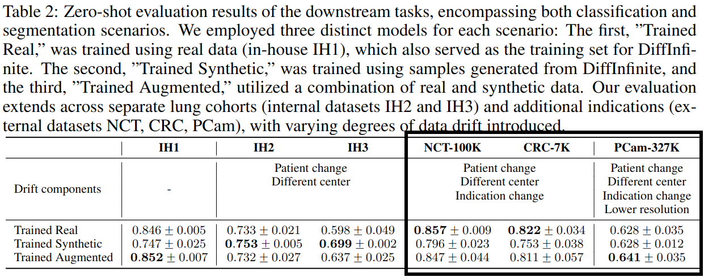

Scripts to create the OOD zero-shot evaluation results of Table 2 of https://arxiv.org/abs/2306.13384.



Assumes saved task models in tf >= 2.13 that can be loaded from a path similar to below

```python
model = tf.saved_model.load('path/to/model/network')
pred = model.signatures["pred_fn"]
```

# Usage

## patchcamelyon-eval.sh
* `bash patchcamelyon-eval.sh -m path/to/model/network`
* add `-r requirements-patchcamelyon.txt` if the venv does not exist, yet
* script will check if PCam exists on local device, download if not from tfds and loop over all three splits of PCam data to output balanced accuracy scores

## nct-crc-eval.ipynb
* update model links in the notebook
* run notebook
* a version that can be directly run on kaggle lives here https://www.kaggle.com/code/duckdonald/notebookd374bcd264/notebook
